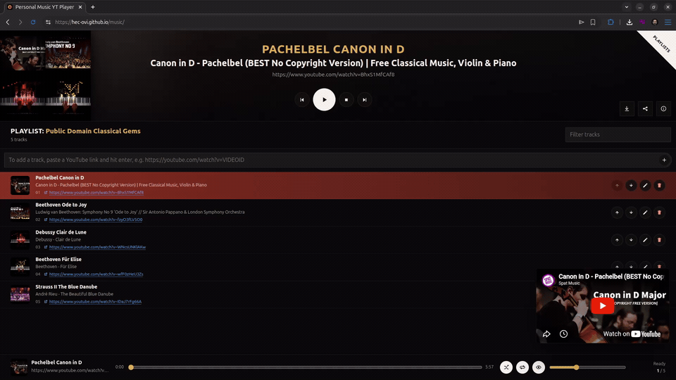

# Personal Music YT Player

**A static, no-backend YouTube playlist player.** Your library lives in your
browser, never in the cloud. Paste ids or links, build lists, press play.

*If you are an agent, read [`SKILL.md`](SKILL.md) first.*

[](https://hec-ovi.github.io/music/)
[](https://hec-ovi.github.io/music/?playlist=Sample%20List%2C%20%5B2frers%20-%20EYES%20ON%20US%20%7C%20CsQ59uMYB_Y%2C%20NAVARA%20-%20FALLEN%20ANGEL%20%7C%20sWd8bc_LkqM%2C%20Sano%20-%20SET%20ME%20FREE%20%7C%20e1QIqXmZ2os%2C%20ruindkid%20-%20Bad%20Pitch%20For%20You%20%7C%20UhaU1ZVu9v0%2C%20KORZIX%20-%20ascend%20%7C%20ibPYPD8Hl4Q%2C%20Oxlo%20-%20Anesthesia%20%7C%20f59m5Pugdw4%2C%20Pat%20-%20Shotgun%20%7C%209fHjcTKV-kg%5D)
[](./LICENSE)


<table>
  <tr>
    <td width="50%"></td>
    <td width="50%"></td>
  </tr>
  <tr>
    <td align="center"><sub>Hero and player</sub></td>
    <td align="center"><sub>Building and playing a list</sub></td>
  </tr>
</table>

The page can be public; your playlists never are. They live only in your
browser's `localStorage`, so there is nothing to host, no account, and nothing
to leak. On top of the standard YouTube video you get a thumbnail-first queue
and full transport controls, or flip the video off and use it as background audio.

## Features

**Build**
- Paste a `Title, [songs]` block (or a bare title for an empty list), or load
  one or more `.md`/`.txt` files in a single pick. Duplicate names are refused,
  never silently merged.
- Add tracks by video id or any YouTube link, mixed and comma or newline
  separated. Bare ids auto-name from the real YouTube title.
- Reorder by drag or arrows, rename, remove. Thumbnails for every list and track.

**Play**
- Thumbnail queue, play / pause / stop, prev / next, seek, shuffle, loop, volume.
- Video shows by default; "Show video" off turns it into pure background audio.
- **Play all** merges your whole library into one queue, badged in red with the
  list each track is actually coming from. Shuffle then mixes everything.
- Filter box: type, hit Enter, and it jumps straight to the first match.
- Winamp-style keyboard shortcuts that ignore text fields.

**Keep and share**
- Everything persists to `localStorage`; one button wipes it clean.
- Export a list as a `.md` file or clipboard text, share it as a self-contained
  URL that rebuilds in someone else's browser, or download your entire library
  as a `playlists.zip` (one `.md` per list).

## Using it

Open the page, open the **Playlists** drawer, and paste into the box: a full
`Playlist Title, [songs]` block, or just a title for an empty list (or import a
file). Paste ids/links into the **Add** field, then click a track to play. Every
row has its own collapse / rename / delete controls; the "?" button opens a quick
visual guide.

Keyboard shortcuts follow the old Winamp layout. They listen page-wide and skip
text fields. (Click into the embedded video and YouTube captures keys until you
click back out.)

```
Z  previous          C  pause
X  restart current   V  stop
B  next              Space  pause / resume
```

Ask an AI agent to turn a list of songs into the import format and paste the
result. Agents should read [`SKILL.md`](SKILL.md); the full reference is in
[`PLAYLISTS_FORMAT.md`](PLAYLISTS_FORMAT.md).

## Run it

```bash
npm install
npm test                  # vitest + jsdom: 100 unit and end-to-end UI tests
python3 -m http.server 8137   # then open http://localhost:8137/
```

ES modules need HTTP, so `file://` will not work.

## How it is built

No build step, no framework, zero runtime dependencies.

- `index.html` is the GitHub Pages entry point; `main.js` mounts the app and
  wires the real YouTube IFrame player.
- `app.js` renders the UI and runs playback. `store.js` is a pure, DOM-free layer
  for `localStorage`, URL/thumbnail helpers, and id/link parsing, tested on its own.
- `styles.css` is the styling.

Publish straight from the `main` branch root:

```bash
gh api repos/<owner>/music/pages --method POST -f source.branch=main -f source.path=/
```

The repo can stay public: it carries no personal playlist data.

## Notes and license

Playback runs through YouTube's official [IFrame Player API](https://developers.google.com/youtube/iframe_api_reference),
so videos stream from YouTube with their ads and embedding settings intact. This
repo hosts no audio, video, or playlists (only fake placeholder ids), and you are
responsible for adding only what you have the right to watch. Not affiliated with
YouTube or Google. MIT, no warranty; see [`LICENSE`](LICENSE).
</content>
</invoke>
