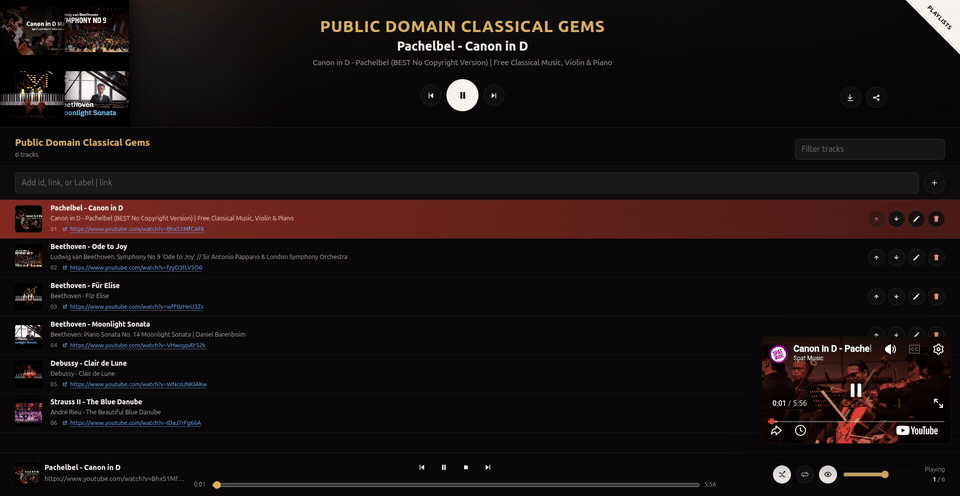

# Personal Music YT Player

*If you are an agent, read [`SKILL.md`](SKILL.md) first.*

*Live: [hec-ovi.github.io/music](https://hec-ovi.github.io/music/)*

[](https://hec-ovi.github.io/music/)
[](https://hec-ovi.github.io/music/?playlist=Sample%20List%2C%20%5B2frers%20-%20EYES%20ON%20US%20%7C%20CsQ59uMYB_Y%2C%20NAVARA%20-%20FALLEN%20ANGEL%20%7C%20sWd8bc_LkqM%2C%20Sano%20-%20SET%20ME%20FREE%20%7C%20e1QIqXmZ2os%2C%20ruindkid%20-%20Bad%20Pitch%20For%20You%20%7C%20UhaU1ZVu9v0%2C%20KORZIX%20-%20ascend%20%7C%20ibPYPD8Hl4Q%2C%20Oxlo%20-%20Anesthesia%20%7C%20f59m5Pugdw4%2C%20Pat%20-%20Shotgun%20%7C%209fHjcTKV-kg%5D)
[](./LICENSE)


[](https://developers.google.com/youtube/iframe_api_reference)




A static, no-backend YouTube playlist player. The page can be public, but your
playlists never are: they live only in your browser's `localStorage`, not in this
repo. You build them yourself by pasting YouTube ids or links.

The YouTube video shows by default, and on top of the standard player you get a
thumbnail-first queue, play/pause, stop, prev/next, a seek timeline, shuffle,
loop, volume, and direct YouTube links. If you just want it as background audio,
"Show video" is a toggle you can turn off.

## What it does

- Create playlists from the Bulk import box: paste a `Playlist Title, [songs]`
  block, or just a title on its own line to start an empty playlist. Rename and
  delete them later. A title that matches an existing playlist is rejected, so an
  import never silently overwrites or merges what you already have.
- Add tracks by pasting a video id or any YouTube link. Both work in the same
  field, mixed and comma or newline separated: `id, link, id, link`.
- Reorder tracks (drag, or the up/down arrows), rename or remove them, add more
  on the fly.
- Play any track on demand, shuffle, loop, scrub the timeline, set volume.
- See YouTube thumbnails for playlists and tracks. Tracks you add as a bare id or
  link with no name get auto-named from the YouTube title (when the browser allows
  the lookup), and any name is cleaned of commas, dots, and other punctuation so it
  stays readable and safe to export.
- Copy a playlist back out as a bulk block, or share it as a URL that rebuilds it
  in someone else's browser.
- Use internal modals for rename/delete flows; no browser prompt/confirm popups.
- Everything persists to `localStorage`, so a reload keeps your library. Wipe it
  all from the drawer's "Clean local data" button.

## Using it

Open the page, open the Playlists drawer, and paste into the Bulk import box: a
full `Playlist Title, [songs]` block, or just a title to make an empty playlist.
The "+" next to "Bulk import format" explains the format with examples. Then
paste ids/links into the Add field and click a track to play it. Click a playlist
to open its editor; the collapse arrow next to its name folds it back. The "?"
button in the top right opens a quick visual guide to the controls and keys.

Keyboard controls (experimental) follow the old Winamp layout. They listen at
the page level and skip text fields, so they work whenever the page has focus. If
you click into the embedded video, the YouTube player captures keystrokes until
you click back onto the page.

```
Z previous
X play current track from the beginning
C pause
V stop
B next
Space pause/resume the current track (does not start playback from scratch)
```

Accepted track inputs (any mix, in one field):

```
VIDEOID0001
https://youtu.be/VIDEOID0002, VIDEOID0003, https://www.youtube.com/watch?v=VIDEOID0004
Track label | VIDEOID0005             # optional "Label | id-or-link"
```

### Bulk import / AI agent format

The Bulk import box accepts one playlist per line:

```
Playlist Title, [id, https://youtu.be/id, Song Name | id]
```

Ask an AI agent to find videos for a list of songs and emit that format, then
paste the result. Agents should read [`SKILL.md`](SKILL.md), a short, copy-paste
ready guide for producing import blocks. The longer reference and a ready prompt
are in [`PLAYLISTS_FORMAT.md`](PLAYLISTS_FORMAT.md).

## Files

- `index.html` is the GitHub Pages entry point.
- `main.js` mounts the app and wires the real YouTube IFrame player.
- `app.js` renders the UI and handles playback; `store.js` holds all the
  localStorage, YouTube URL, thumbnail, and id/link parsing logic.
- `styles.css` is the styling. `PLAYLISTS_FORMAT.md` documents the import format.

No build step. GitHub Pages serves it straight from the repository root.

## Development

```bash
npm install
npm test          # vitest + jsdom, unit + end-to-end UI tests
```

To run it locally, serve the folder over HTTP (ES modules need it; `file://`
will not work):

```bash
python3 -m http.server 8137
# open http://localhost:8137/
```

## GitHub Pages

Publish from the `main` branch root:

```bash
gh api repos/<owner>/music/pages \
  --method POST \
  -f source.branch=main \
  -f source.path=/
```

Then the site is at `https://<owner>.github.io/music/`. The repo can stay public
since it carries no personal playlist data.

## For AI agents

If you are an agent building a playlist for someone, read [`SKILL.md`](SKILL.md).
It is a short, copy-paste ready guide for emitting the bulk-import block the user
pastes into the app. [`PLAYLISTS_FORMAT.md`](PLAYLISTS_FORMAT.md) is the longer
reference.

## Copyright and responsible use

This is a personal tool for organizing your own YouTube listening (for example,
videos from your own channel, or public videos you have the right to watch and
embed). It is built to stay on the right side of YouTube and Google:

- **It never downloads, rips, copies, caches, or rehosts any video or audio.**
  Playback runs through YouTube's official
  [IFrame Player API](https://developers.google.com/youtube/iframe_api_reference),
  so every video plays inside YouTube's own embedded player, subject to the
  [YouTube API Services Terms](https://developers.google.com/youtube/terms/api-services-terms-of-service)
  and [Developer Policies](https://developers.google.com/youtube/terms/developer-policies).
  This is the same embedding mechanism any website uses.
- **It does not block or strip ads and does not touch analytics.** The embedded
  player serves YouTube's ads and reporting exactly as it would anywhere else. (If
  you run an ad blocker, that is your browser blocking those requests, not this
  app.)
- **It respects each creator's settings.** A video whose owner disabled embedding
  simply will not play here.
- **No video content or playlist lives in this repository.** The code ships with
  obviously fake placeholder ids only (`VIDEOID0001`, etc.). Real video ids and
  links exist solely in your browser's `localStorage`, and in share URLs you
  generate yourself, never in git. So the public repo contains no references to
  anyone's copyrighted videos.
- **You are responsible for what you put in it.** Only add content you are allowed
  to watch and embed.

This project is not affiliated with, endorsed by, or sponsored by YouTube or
Google. "YouTube" and "Google" are trademarks of Google LLC. The software license
covers this code only; it grants no rights to any video content.

**Reporting.** This project hosts no audio or video and keeps no copy of anyone's
playlists, so there is nothing here to take down. If a specific video is
infringing, report it to YouTube, where it is hosted, not to this repository.
Issues claiming infringement by embedded videos will be closed, since the videos
are served by YouTube under YouTube's own terms.

**No warranty.** The software is provided "as is", without warranty of any kind,
and is intended for lawful personal use. You are responsible for what you play
through it and for complying with YouTube's Terms of Service and applicable law.
The authors are not liable for how anyone else uses it. See [`LICENSE`](LICENSE).
